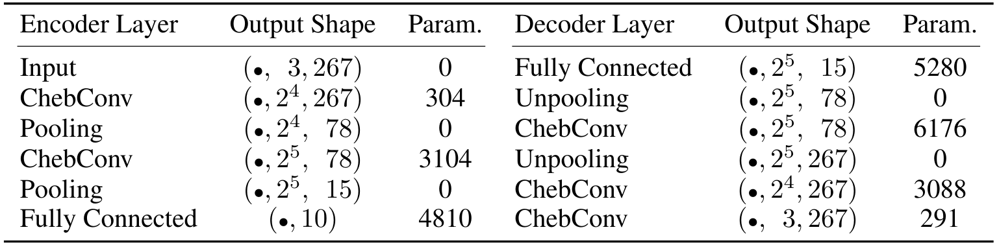

# Transfer Learning using Spectral Convolutional Autoencoders on Semi-Regular Surface Meshes

### Implementation of spectral CoSMA: Convolutional Semi-Regular Mesh Autoencoder

<!---[paper]()

[arXiv publication]()-->

**Sara Hahner**  
*Fraunhofer Center for Machine Learning and SCAI, Sankt Augustin, Germany*   

**Felix Kerkhoff**  
*Johannes Kepler Universität, Linz, Austria*

**Jochen Garcke**  
*Fraunhofer Center for Machine Learning and SCAI, Sankt Augustin, Germany*   
*Institut für Numerische Simulation, Universität Bonn, Germany*

Contact sara.hahner@scai.fraunhofer.de for questions about code and data.

## 1. Abstract

The underlying dynamics and patterns of 3D surface meshes deforming over time can be discovered by unsupervised learning, especially autoencoders, which calculate low-dimensional embeddings of the surfaces.
To study the deformation patterns of unseen shapes by transfer learning, we want to train an autoencoder that can analyze new surface meshes without training a new network.
Here, most state-of-the-art autoencoders cannot handle meshes of different connectivity and therefore have limited to no generalization capacities to new meshes. Also, reconstruction errors strongly increase in comparison to the errors for the training shapes.
To address this, we propose a novel spectral CoSMA (Convolutional Semi-Regular Mesh Autoencoder) network. This patch-based approach is combined with a surface-aware training. It reconstructs surfaces not presented during training and generalizes the deformation behavior of the surfaces' patches.
The novel approach reconstructs unseen meshes from different datasets in superior quality compared to state-of-the-art autoencoders that have been trained on these shapes. Our transfer learning errors on unseen shapes are 40\% lower than those from models learned directly on the data.
Furthermore, baseline autoencoders detect deformation patterns of unseen mesh sequences only for the whole shape. In contrast, due to the employed regional patches and stable reconstruction quality, we can localize where on the surfaces these deformation patterns manifest. 

## 2. Python Packages

- pytorch (1.11.0)
- pytorch geometric (2.0.4)
- igl python bindings (2.2.1) (conda install -c conda-forge igl)
- argparse 

## 3. Scripts and Code:
- [training](training.py): Train the autoencoder on all training samples of the given dataset
- [testing](testing.py): Set the patches back together and calculate the P2S-errors (point to surface) as done for the paper. Plot reconstructions.
- [cosma](cosma): Definition of the spectral CoSMA, which considers the padded regular patches of the semi-regular meshes
- [utils](utils): Classes and funtions of general utility

## 4. Results

In the directory [experiments](experiments) you can find our trained models. Compare your results to the training errors in the experiment-runner-txt-files [GALLOP-Log-File](experiments/gallop_r4_2203/gallop/experiment_runner_gallop.txt). 

These files are written by the training and testing scripts. We provide the GALLOP dataset to reproduce the training and testing of the autoencoder for semi-regular meshes of different sizes.



## 5. Datasets and Reproduction of the Results

Each dataset has different         
- versions: for the car datasets there is one directory for each simulations
- samples: for every version there are the same samples. Every sample can have a different mesh (car-dataset: different components, gallop: different animals, FAUST: different persons)

The original meshes are only necessary for the calculation of the P2S (point to surface) distance.

File Structure in [DATA](DATA):
- name of the dataset
  - versions
    - samples
      - obj-files of semi-regular meshes
      - pickle files containing the padded patches already extracted from obj-files
  - adjacency matrix for patches
  - node-ids per patch: for reconstrction of meshes from patches
  
- original meshes
  - name of the dataset
    - *raw*: obj or ply files for each sample and version over time
    - *preprocessed*: for every sample we provide the semi-regular base mesh
    - *semiregular*: for every sample we provide the semi-regular mesh, which has been refined and fit to the shape of the irregular template mesh


#### GALLOP

**Sumner et al: 2004: Deformation transfer for triangle meshes** [Webpage](https://people.csail.mit.edu/sumner/research/deftransfer/)

A dataset containing triangular meshes representing motion sequences from a galloping horse, elephant, and camel. Each sequence has 48 timesteps. The three animals move in a similar way but the meshes that represent the surfaces of the three animals are highly different in connectivity and in the number of vertices. 

```
python training.py --dataset gallop_r4_2203 --test_split elephant --test_ratio 0.3 --model_name gallop --refine 4 --hid_rep 10 --seed 1 --patch_zeromean True --surface_aware_loss True --Niter 150

python testing.py --spec_dataset gallop_r4_2203 --exp_name r4_coarsenfinal --dataset gallop --test_split elephant --test_ratio 0.3 --model_name gallop --refine 4 --hid_rep 10 --seed 1 --patch_zeromean True --surface_aware_loss True --plots True
```
#### TRUCK and FAUST

Data with refinement level 3 available at: [Spatial CoSMA repository](https://github.com/Fraunhofer-SCAI/conv_sr_mesh_autoencoder)
Semi-regular meshes with refinement level 4 are following. 

## 6. Citation

```markdown
@InProceedings{Hahner2022b,
    author    = {Hahner, Sara and Kerkhoff, Felix and Garcke, Jochen},
    title     = {Transfer Learning using Spectral Convolutional Autoencoders on Semi-Regular Surface Meshes},
    booktitle = {Proceedings of the First Learning on Graphs Conference (LoG 2022)},
    month     = {December},
    year      = {2022},
}
```
